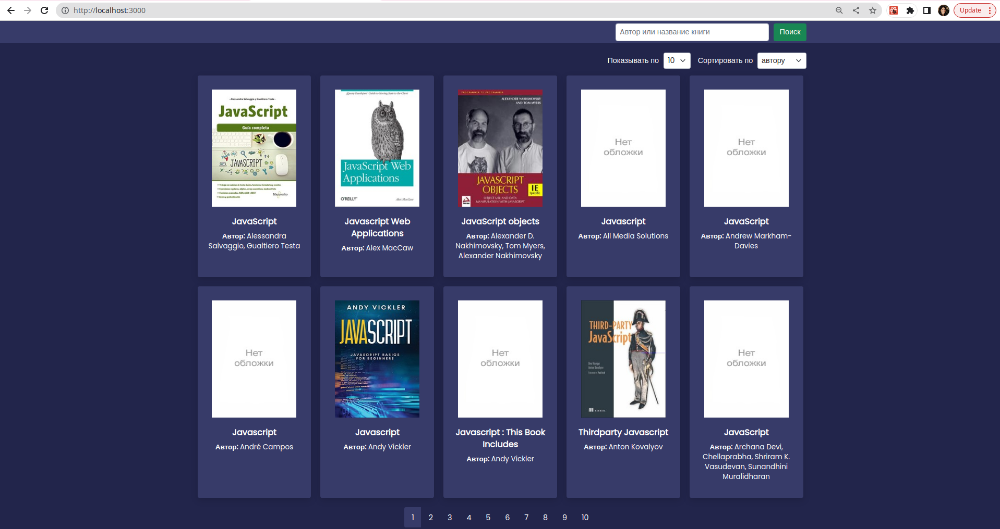
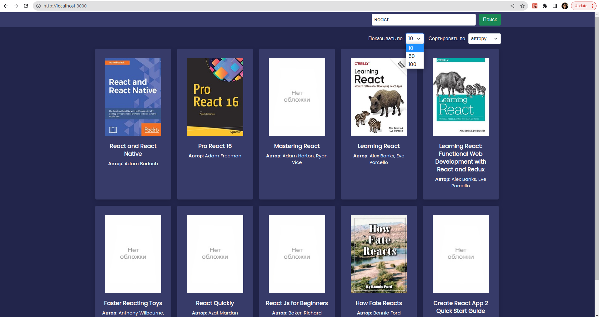
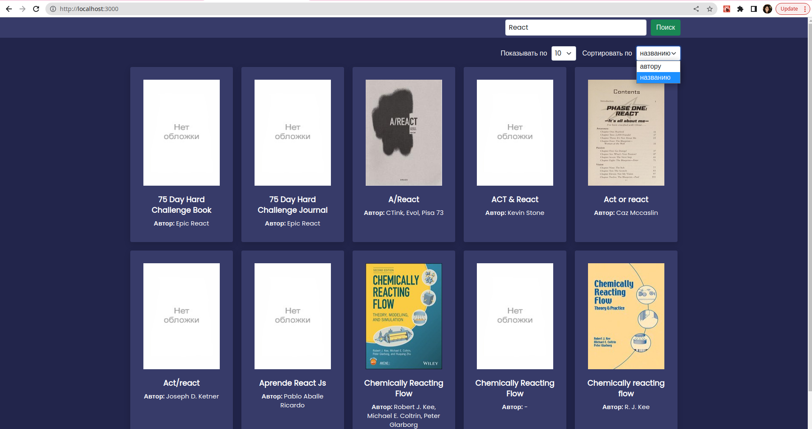

# Book-search-app


## Description

 Book-search-app searches for books by author or title. The app uses [Open Library]('https://openlibrary.org/'). Open Library offers free, public [Web APIs](https://openlibrary.org/developers/api) for accessing book and author catalog data.

## Setup

```sh
$ https://github.com/asenka0301/Book-search-app.git
$ npm ci
$ npm start
```

## <a href="https://book-search-app-vybe.onrender.com/" target="_blank">Book-Search-App Live Demo</a>

## UI example

### Book-search-app

### Book-search-app-show by

### Book-search-app-sort by
